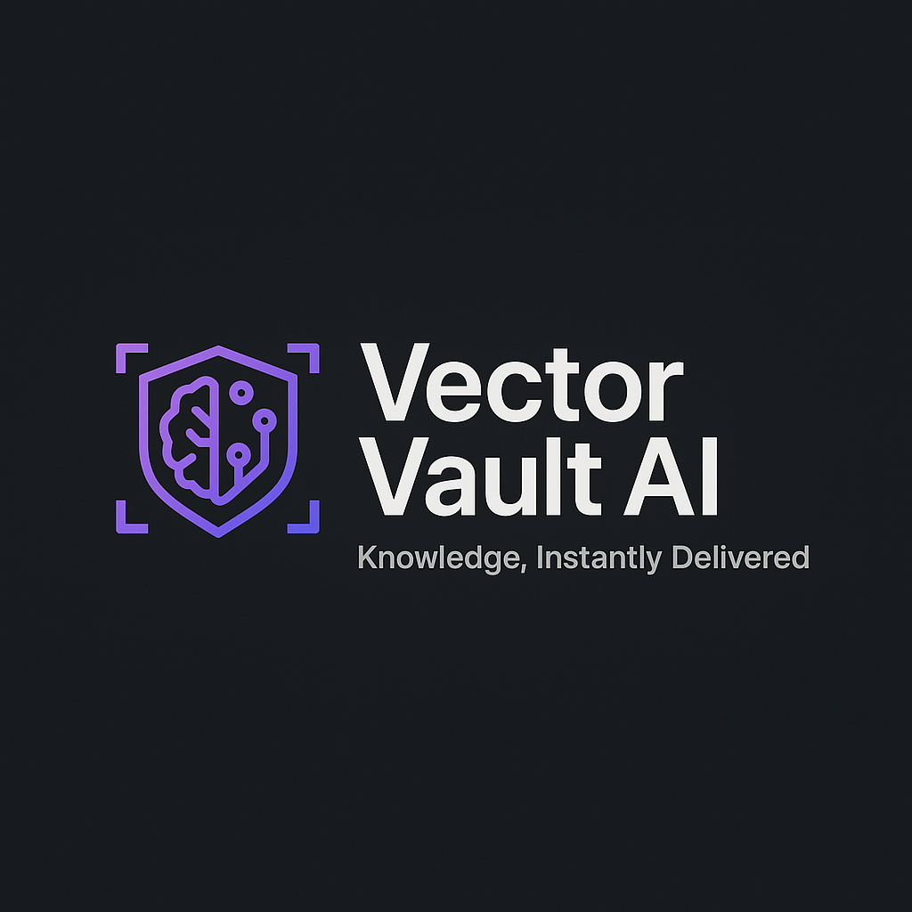

# VectorVault

> Knowledge, Instantly Retrieved

VectorVault is a simple document search engine that uses OpenAI embeddings and FAISS vector database to provide semantic search capabilities.

<div align="center">
  
</div>

## Features

- 🔍 **Semantic Search**: Use natural language to find documents based on meaning, not just keywords
- 📄 **Individual Document Uploads**: Add documents one at a time with metadata
- 📚 **Batch Processing**: Upload multiple documents via CSV or JSON files
- 🧠 **AI-Powered**: Uses OpenAI embeddings for state-of-the-art semantic understanding
- 💾 **Persistent Storage**: Document metadata and vector indices are stored for future use
- 🌐 **REST API**: Simple HTTP endpoints for integration with other applications
- 🖥️ **Streamlit UI**: User-friendly interface for document management and search

## Table of Contents

- [Getting Started](#getting-started)
  - [Prerequisites](#prerequisites)
  - [Installation](#installation)
  - [Configuration](#configuration)
- [Running the Application](#running-the-application)
- [Usage](#usage)
  - [Adding Documents](#adding-documents)
  - [Batch Upload](#batch-upload)
  - [Searching Documents](#searching-documents)
- [API Documentation](#api-documentation)
- [Project Structure](#project-structure)
- [Testing](#testing)
- [Contributing](#contributing)
- [License](#license)

## Getting Started

### Prerequisites

- Python 3.8 or higher
- An OpenAI API key (get one at [OpenAI Platform](https://platform.openai.com/))
- Git (for cloning the repository)

### Installation

1. Clone the repository:
   ```bash
   git clone https://github.com/yourusername/vectorvault.git
   cd vectorvault
   ```

2. Set up a virtual environment (recommended):
   ```bash
   # On Windows
   python -m venv venv
   venv\Scripts\activate

   # On macOS/Linux
   python -m venv venv
   source venv/bin/activate
   ```

3. Install dependencies:
   ```bash
   pip install -r requirements.txt
   ```

### Configuration

1. Create a `.env` file based on the example:
   ```bash
   cp .env.example .env
   ```

2. Edit the `.env` file and add your OpenAI API key:
   ```
   OPENAI_API_KEY = "your-openai-api-key-here"
   EMBEDDING_MODEL = "text-embedding-3-small"
   LLM = "gpt-4o"
   ```

## Running the Application

VectorVault consists of two components: a Flask API backend and a Streamlit frontend.

1. Start the Flask backend:
   ```bash
   python app.py
   ```
   This will start the API server on `http://localhost:5000`.

2. In a new terminal, start the Streamlit frontend:
   ```bash
   # Make sure your virtual environment is activated
   streamlit run streamlit_app.py
   ```
   This will start the Streamlit UI on `http://localhost:8501`.

## Usage

### Adding Documents

1. Open the Streamlit UI at `http://localhost:8501`
2. Navigate to the "Upload Documents" tab
3. Enter your document text and metadata
4. Click "Upload Document"

### Batch Upload

You can upload multiple documents at once using either CSV or JSON format:

#### CSV Format

Create a CSV file with these columns:
- `text` (required): The document content
- Any other columns will be included as metadata

Example:
```csv
text,source,category,author
"MongoDB uses BSON, a binary representation of JSON documents.",MongoDB Docs,Technical,MongoDB Team
```

Sample CSV files are available in the `sample_data` directory.

#### JSON Format

Create a JSON file with an array of objects:
```json
[
  {
    "text": "Your document content here",
    "metadata": {
      "source": "Wikipedia",
      "category": "Science"
    }
  }
]
```

Sample JSON files are available in the `sample_data` directory.

### Searching Documents

1. Navigate to the "Search" tab
2. Enter your search query
3. Set the number of results to return
4. Click "Search"

Results are ranked by semantic similarity to your query, not just keyword matching.

## API Documentation

### Health Check
- `GET /health` - Check system status

### Document Management
- `POST /documents` - Add a single document
  ```json
  {
    "text": "Your document content here",
    "metadata": {
      "source": "Wikipedia",
      "category": "Science"
    }
  }
  ```

- `POST /documents/batch` - Add multiple documents
  ```json
  [
    {
      "text": "First document",
      "metadata": { "source": "Book" }
    },
    {
      "text": "Second document",
      "metadata": { "source": "Website" }
    }
  ]
  ```

### Search
- `GET /search?q=your+query+here&n=5` - Search for documents
  - `q` or `query`: The search query (required)
  - `n`: Number of results to return (optional, defaults to 5)

## Project Structure

```
vectorvault/
├── app.py                  # Flask backend
├── streamlit_app.py        # Streamlit frontend
├── app_logo.png            # Application logo
├── requirements.txt        # Python dependencies
├── requirements-dev.txt    # Development dependencies
├── .env                    # Environment variables (not in repo)
├── .env.example            # Template for environment variables
├── .gitignore              # Git ignore file
├── LICENSE                 # MIT License
├── README.md               # This documentation
├── setup.py                # Setup script
├── load_sample_data.py     # Script to load sample data
├── sample_data/            # Example data for testing
│   ├── mongodb_docs.csv    # Sample CSV data
│   └── mongodb_features.json  # Sample JSON data
├── tests/                  # Test files
│   ├── conftest.py         # Pytest fixtures
│   ├── test_embedding.py   # Embedding tests
│   ├── test_document_validation.py # Validation tests
│   ├── test_api_endpoints.py # API tests
│   ├── test_metadata_persistence.py # Metadata persistence tests 
│   ├── test_batch_processing.py # Batch processing tests
│   └── README.md           # Test documentation
├── faiss_index.index       # FAISS vector index (generated)
└── document_metadata.json  # Document metadata storage (generated)
```

## Testing

VectorVault includes a comprehensive test suite to ensure functionality works as expected. The tests cover core functions, API endpoints, and data persistence.

### Running Tests

```bash
# Install development dependencies
pip install -r requirements-dev.txt

# Run all tests
pytest

# Run tests with coverage report
pytest --cov=app
```

See the [tests/README.md](tests/README.md) file for more information on the test structure and how to write new tests.

## Contributing

Contributions are welcome! Here's how you can contribute:

1. Fork the repository
2. Create a feature branch: `git checkout -b feature-name`
3. Commit your changes: `git commit -m 'Add some feature'`
4. Push to the branch: `git push origin feature-name`
5. Open a pull request

## License

This project is licensed under the MIT License - see the [LICENSE](LICENSE) file for details.

---

<div align="center">
  
  <p><em>VectorVault - Knowledge, Instantly Retrieved</em><br>
  Powered by OpenAI and FAISS</p>
</div> 